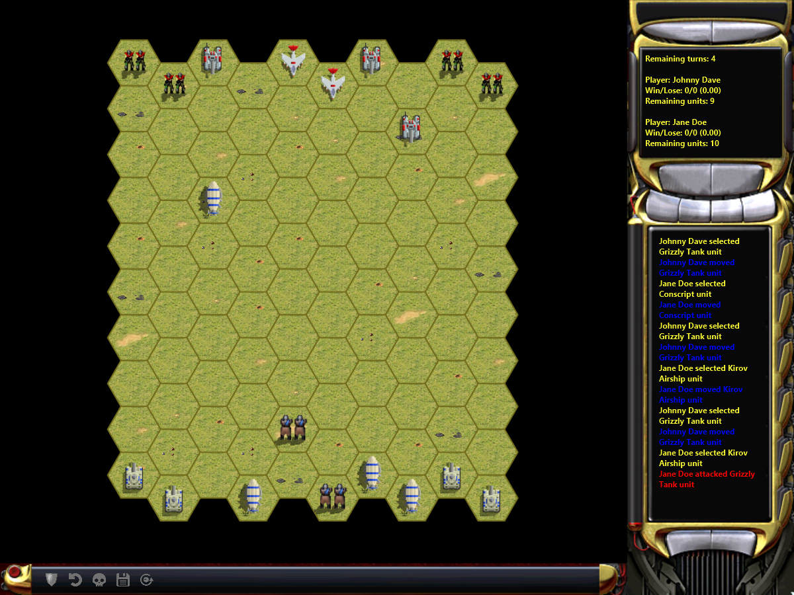
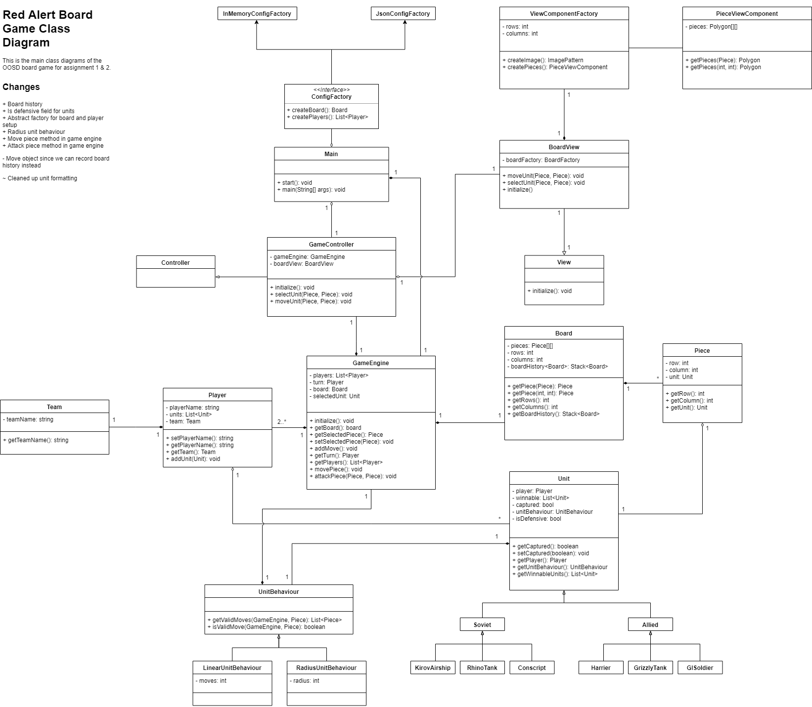
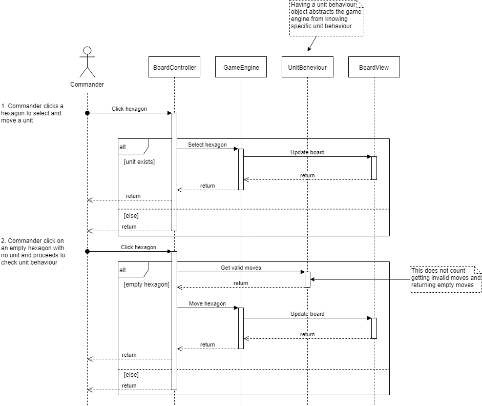

# Red Alert 2 Board Game

A Command & Conquer themed board game for RMIT course Object Orientated Software Design Assignment 1 & 2.

## Participants & Contribution

Project has been forked to avoid work collision. Senadhi will be working on a separate copy of this assignment.

- Johnny Huynh - 60%
- Chee Wei Low - 40%
- Udahakapugedara Madhusanka Senadhi - 0%
- Stanley Elliott - 0%

## How it works

The project is a 2D gameBoard game using different shapes from standard squares on the board.

We have units that can move depending on their unit behaviour by clicking and moving units on the board. This is similar to a traditional chess game but with a few twists!



### Gameplay

The game is predetermined by configs at runtime to layout players and pieces on the board. This is a free-for-all game where there are no teams to reduce game complexity and not needed scope.

Game can only start with a **minimum of 2 players**. Players can select and move units once on a rotating turn.

Combat in units is similar to a chess game where units can conquer other pieces on the gameBoard, however this is **limited by specified winnable units**. Units can be set to a defensive status which disallows other units to attack them at the cost of **one move**.

To win a game, the player with the **most amount of units** wins after a certain amount of turns or if the **player is the last one standing**.

## Design Patterns and Choices

### Creational

#### Abstract Factory Pattern

We've use the pattern in one area particularly at game setup. There was a problem to split out game creation where there was only one single way to create the game, which was *"in memory in code"*. We wanted a solution that would extend the game creation to more **storage mediums** such as database (SQL, NoSQL) or file storage (text, JSON, YAML).

Creating a **single factory** for each method could suffice, however it could lead to more *redundant code*. Using an **abstract factory** reduces this effect and also allowing a clear interface for more factories to be produced.

#### Factory pattern

Not only have we used the abstract factory pattern, we've also used the single factory pattern to produce **UI components** in our board view. The hexagon pieces need to be created based on hexagon objects, which require methods to create the object.

### Structural

#### Composite

With the use of UI libraries, we were able to utilise this pattern to add nested components to produce a game view.

#### Facade

We've used the facade pattern an numerous occasions to solve high level models communicating with irrelevant implementations. For instance, the *JsonGameSetupReader* was used to extract the JSON parsing mechanism for the game setup objects to interface the facade with string inputs.

This works in unison with the *GameSetupFactory* where it uses the **abstract factory pattern** to create the game at startup to hide away raw JSON parsing logic from the factory itself. We could of resolved this with an adapter pattern, however that pattern would only allow us to interface with a *single object* rather than an entire sub-system of objects.

### Behavioral

#### Command

Using the command pattern was implemented by calling the **board history** object to abstract logic from the engine to save and restore game snapshots.

We could of left it up to the engine to decide on **game state storage**, however this would lead on to a *greater responsibility* for the engine to do more tasks. In this particular case, we shouldn't let the game engine manage snapshots.

#### Memento

There was no other pattern that was well suited to **store game state** due to how it allows us to revert and save game state in a clean way.

A *glaring issue* is how snapshots have to create entirely new objects to save state, thus producing more memory usage and degraded performance.

#### Template

Units are using this pattern to configure its **specific attributes** such as unit behavior and defend turns a unit can make.

There are other ways to store this internal logic such us *hard-coding booleans and strings* to identify **unique units**. However, this would potentially cause more duplication in logic compared to using inherited object attributes.

Our user interface components are also wrapped in our own object to re-configure and create the object in a specific state with the inherited object.

## Development Environment

In order to run this we need to match these requirements:

- Any OS
- Java version **11** SDK
- Eclipse or IntelliJ (my bias says IntelliJ 😅)
- A love for Red Alert 2

### Running the game

There are specific ways to start up this game depend on which IDE you use.

#### Eclipse

Make sure you do not have any other gameBoard game copies on your system.

- Pull the project from **GitHub desktop**
- Import an existing **Maven** project `Maven > Existing Maven Projects`
- Right click on the project and go to `Maven > Update Project`
- Right click on the top status menu `Run > Run Configurations...`
- Create a `Maven Build` step with the following **goals**

```bash
clean install exec:java
```

#### IntelliJ

- Pull the project from **GitHub desktop**
- Import the project from Maven
- Right click on the top status menu `Run > Edit Configurations...`
- Create a `Maven` step with the following `command line`

```bash
clean install exec:java
```

## Analysis

We've produced a few class diagrams to show our iterative process in developing the game.

### Class diagram V1


### Current class diagram



### Mouse click handling on gameBoard sequence diagram

We've created a sequence diagram describing the game piece handling a mouse click.


