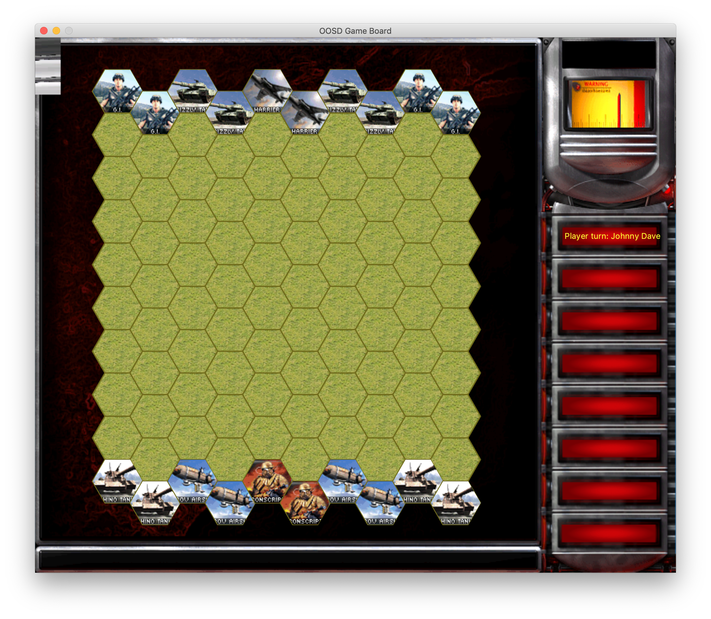
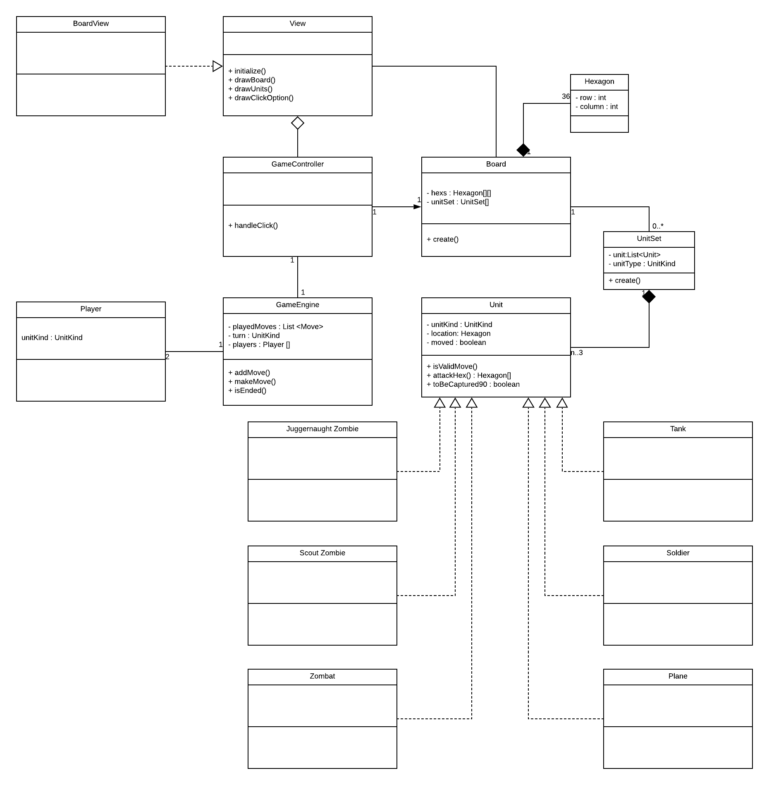
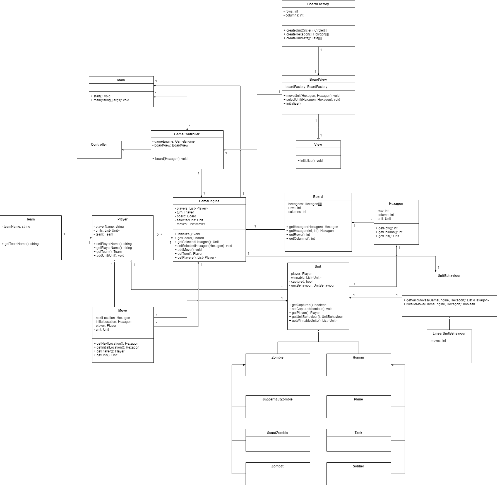

# Red Alert 2 Board Game

A Command & Conquer themed board game for RMIT course Object Orientated Software Design Assignment 1 & 2.

## Participants & Contribution

- Johnny Huynh - 65%
- Chee Wei Low - 25%
- Udahakapugedara Madhusanka Senadhi - 10%
- Stanley Elliott - 0%

## How it works

The project is a 2D board game using different shapes from standard squares on the board.

We have units that can move depending on their unit behaviour by clicking and moving units on the board. This is similar to a traditional chess game but with a few twists!



## Development Environment

In order to run this we need to match these requirements:

- Any OS
- Java version **11** SDK
- Eclipse or IntelliJ (my bias says IntelliJ 😅)
- A love for Red Alert 2

### Running the game

There are specific ways to start up this game depend on which IDE you use.

#### Eclipse

Make sure you do not have any other board game copies on your system.

- Pull the project from **GitHub desktop**
- Import an existing **Maven** project `Maven > Existing Maven Projects`
- Right click on the project and go to `Maven > Update Project`
- Right click on the top status menu `Run > Run Configurations...`
- Create a `Maven Build` step with the following **goals**

```$xslt
clean install exec:java
``` 

#### IntelliJ

- Pull the project from **GitHub desktop**
- Import the project from Maven
- Right click on the top status menu `Run > Edit Configurations...`
- Create a `Maven` step with the following `command line`

```$xslt
clean install exec:java
``` 

## Analysis

We've produced a few class diagrams to show our iterative process in developing the game.

### Class diagram V1



### Our current class diagram


